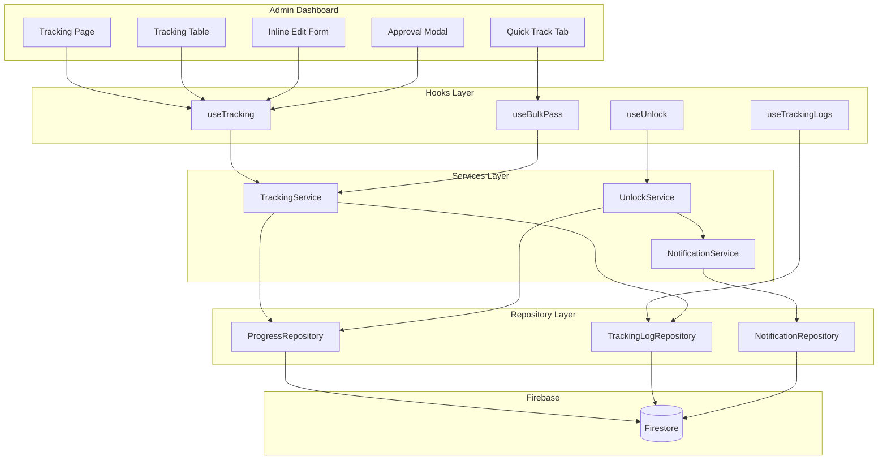

# Design Document - Phase 4: Tracking & Progress

## Overview

Phase 4 xây dựng hệ thống tracking để Admin quản lý tiến độ học viên. Hệ thống bao gồm:
- Bảng tracking với filter, search, sort, pagination
- Inline edit để cập nhật số buổi/dự án
- Logic pass môn với approval workflow
- Quick Track để bulk pass nhiều học viên
- Tự động unlock môn/học kỳ tiếp theo
- Audit trail cho compliance

## Architecture



## Components and Interfaces

### Page Components

```
apps/admin/src/app/(dashboard)/tracking/
├── page.tsx                    # Main tracking page with tabs
└── layout.tsx                  # Optional layout wrapper
```

### Feature Components

```
apps/admin/src/components/features/tracking/
├── TrackingTable/
│   ├── TrackingTable.tsx       # Main table component
│   ├── TrackingRow.tsx         # Individual row with inline edit
│   ├── TrackingFilters.tsx     # Semester/Course/Search filters
│   ├── TrackingPagination.tsx  # Pagination controls
│   └── index.ts
├── QuickTrack/
│   ├── QuickTrackTable.tsx     # Bulk selection table
│   ├── QuickTrackActions.tsx   # Select all, Pass selected buttons
│   ├── BulkPassModal.tsx       # Confirmation modal
│   ├── BulkPassReport.tsx      # Results summary
│   └── index.ts
├── InlineEdit/
│   ├── SessionsDropdown.tsx    # Inline sessions editor
│   ├── ProjectsDropdown.tsx    # Inline projects editor
│   ├── ProjectLinksEditor.tsx  # Add/edit project links
│   └── index.ts
├── StatusActions/
│   ├── ApproveButton.tsx       # Approve action
│   ├── RejectModal.tsx         # Reject with reason
│   ├── StatusBadge.tsx         # Status display
│   └── index.ts
└── TrackingLogs/
    ├── TrackingLogList.tsx     # Log entries display
    └── index.ts
```

### Hooks

```
apps/admin/src/hooks/
├── useTracking.ts              # Main tracking data hook
├── useTrackingFilters.ts       # Filter state management
├── useInlineEdit.ts            # Inline edit logic
├── useBulkPass.ts              # Bulk pass operations
├── useUnlock.ts                # Unlock logic
└── useTrackingLogs.ts          # Audit log queries
```

### Component Interfaces

```typescript
// TrackingTable Props
interface TrackingTableProps {
  data: TrackingData[];
  isLoading: boolean;
  onUpdateProgress: (studentId: string, courseId: string, update: ProgressUpdate) => Promise<void>;
  onApprove: (studentId: string, courseId: string) => Promise<void>;
  onReject: (studentId: string, courseId: string, reason: string) => Promise<void>;
}

// TrackingFilters Props
interface TrackingFiltersProps {
  semesters: Semester[];
  courses: Course[];
  selectedSemesterId: string | null;
  selectedCourseId: string | null;
  searchTerm: string;
  onSemesterChange: (id: string | null) => void;
  onCourseChange: (id: string | null) => void;
  onSearchChange: (term: string) => void;
}

// QuickTrackTable Props
interface QuickTrackTableProps {
  data: PendingApprovalData[];
  selectedIds: Set<string>;
  onSelectionChange: (ids: Set<string>) => void;
  onSelectAll: () => void;
  onDeselectAll: () => void;
}

// BulkPassModal Props
interface BulkPassModalProps {
  isOpen: boolean;
  selectedCount: number;
  onConfirm: () => Promise<void>;
  onCancel: () => void;
  isProcessing: boolean;
  progress: number;
}
```

## Data Models

### Extended Progress Schema

```typescript
// packages/schemas/src/progress.schema.ts (extended)

export const ExtendedProgressStatusSchema = z.enum([
  'not_started',
  'in_progress', 
  'pending_approval',
  'completed',
  'rejected',
  'locked'
]);

export type ExtendedProgressStatus = z.infer<typeof ExtendedProgressStatusSchema>;

export const ExtendedStudentProgressSchema = BaseEntitySchema.extend({
  studentId: IdSchema,
  courseId: IdSchema,
  completedSessions: z.number().int().nonnegative().default(0),
  projectsSubmitted: z.number().int().nonnegative().default(0),
  projectLinks: z.array(z.string().url()).default([]),
  status: ExtendedProgressStatusSchema.default('not_started'),
  
  // Approval workflow fields
  rejectionReason: z.string().optional(),
  approvedAt: TimestampSchema.nullable().default(null),
  approvedBy: IdSchema.optional(),
  
  completedAt: TimestampSchema.nullable().default(null),
});

export type ExtendedStudentProgress = z.infer<typeof ExtendedStudentProgressSchema>;
```

### Tracking Log Schema

```typescript
// packages/schemas/src/tracking-log.schema.ts

export const TrackingActionSchema = z.enum([
  'update_sessions',
  'update_projects',
  'add_project_link',
  'remove_project_link',
  'approve',
  'reject',
  'unlock_course',
  'unlock_semester'
]);

export type TrackingAction = z.infer<typeof TrackingActionSchema>;

export const TrackingLogSchema = BaseEntitySchema.extend({
  studentId: IdSchema,
  courseId: IdSchema,
  action: TrackingActionSchema,
  previousValue: z.unknown().optional(),
  newValue: z.unknown().optional(),
  performedBy: IdSchema, // admin userId
  performedAt: TimestampSchema,
});

export type TrackingLog = z.infer<typeof TrackingLogSchema>;
```

### Notification Schema

```typescript
// packages/schemas/src/notification.schema.ts

export const NotificationTypeSchema = z.enum([
  'course_completed',
  'course_rejected',
  'course_unlocked',
  'semester_unlocked'
]);

export type NotificationType = z.infer<typeof NotificationTypeSchema>;

export const NotificationSchema = BaseEntitySchema.extend({
  userId: IdSchema, // student userId
  type: NotificationTypeSchema,
  title: z.string(),
  message: z.string(),
  metadata: z.record(z.unknown()).optional(),
  isRead: z.boolean().default(false),
  readAt: TimestampSchema.nullable().default(null),
});

export type Notification = z.infer<typeof NotificationSchema>;
```

### Tracking Data View Model

```typescript
// apps/admin/src/types/tracking.types.ts

export interface TrackingData {
  studentId: string;
  studentName: string;
  studentEmail: string;
  courseId: string;
  courseName: string;
  semesterId: string;
  semesterName: string;
  completedSessions: number;
  requiredSessions: number;
  projectsSubmitted: number;
  requiredProjects: number;
  projectLinks: string[];
  status: ExtendedProgressStatus;
  canPass: boolean;
  missingConditions: string[];
}

export interface ProgressUpdate {
  completedSessions?: number;
  projectsSubmitted?: number;
  projectLinks?: string[];
}

export interface BulkPassResult {
  total: number;
  success: number;
  failed: number;
  failures: Array<{
    studentId: string;
    studentName: string;
    reason: string;
  }>;
}
```

## Correctness Properties

*A property is a characteristic or behavior that should hold true across all valid executions of a system-essentially, a formal statement about what the system should do. Properties serve as the bridge between human-readable specifications and machine-verifiable correctness guarantees.*

### Property 1: Filter Results Consistency
*For any* semester filter selection, all displayed courses in the tracking table should belong to that selected semester.
**Validates: Requirements 1.3**

### Property 2: Search Results Containment
*For any* search term entered, all students in the filtered results should have either name or email containing that search term (case-insensitive).
**Validates: Requirements 1.5**

### Property 3: Pagination Threshold
*For any* list of students with count > 20, the tracking table should display pagination controls and limit visible rows to the page size.
**Validates: Requirements 1.6**

### Property 4: Sort Order Preservation
*For any* column sort action, the resulting table rows should be ordered by that column's values in the specified direction (ascending or descending).
**Validates: Requirements 1.7**

### Property 5: Session Count Validation
*For any* session count update attempt where the new value exceeds the course's requiredSessions, the system should reject the update and return a validation error.
**Validates: Requirements 2.4**

### Property 6: Project Count Validation
*For any* project count update attempt where the new value exceeds the course's requiredProjects, the system should reject the update and return a validation error.
**Validates: Requirements 2.5**

### Property 7: URL Format Validation
*For any* project link addition, the system should validate the URL format and reject invalid URLs.
**Validates: Requirements 2.6**

### Property 8: Pass Condition Detection
*For any* progress record where completedSessions >= requiredSessions AND projectsSubmitted >= requiredProjects AND projectLinks.length >= 1, the status should automatically transition to pending_approval.
**Validates: Requirements 3.1**

### Property 9: Approval State Transition
*For any* approve action on a pending_approval progress, the status should change to completed with approvedAt timestamp and approvedBy userId recorded.
**Validates: Requirements 3.3**

### Property 10: Rejection State Transition
*For any* reject action with a reason, the status should change to rejected with rejectionReason stored as a non-empty string.
**Validates: Requirements 3.5**

### Property 11: Quick Track Filter
*For any* student displayed in the Quick Track tab, their progress status should be pending_approval.
**Validates: Requirements 4.1**

### Property 12: Select All Completeness
*For any* "Select All" action in Quick Track, all visible student checkboxes should be checked.
**Validates: Requirements 4.3**

### Property 13: Bulk Pass Processing
*For any* bulk pass operation, all selected students should be processed and the result should accurately report success and failure counts.
**Validates: Requirements 4.5, 4.6**

### Property 14: Bulk Pass Resilience
*For any* bulk pass operation where some students fail, the remaining students should still be processed and failures should be included in the report.
**Validates: Requirements 4.7**

### Property 15: Next Course Unlock
*For any* progress status change to completed, if a next course exists in the same semester (by order), that course's progress status should change from locked to not_started.
**Validates: Requirements 5.1, 5.2**

### Property 16: Semester Completion Check
*For any* completed course that is the last in its semester, the system should verify all courses in that semester are completed before unlocking the next semester.
**Validates: Requirements 5.3, 5.4**

### Property 17: Semester Transition
*For any* semester where all courses are completed, if a next semester exists, the student's currentSemesterId should be updated and the first course of the new semester should be unlocked.
**Validates: Requirements 5.5**

### Property 18: Progress Status Enum Validation
*For any* progress record, the status field should be one of: not_started, in_progress, pending_approval, completed, rejected, locked.
**Validates: Requirements 6.1**

### Property 19: Rejection Reason Required
*For any* progress with status rejected, the rejectionReason field should be a non-empty string.
**Validates: Requirements 6.2**

### Property 20: Approval Metadata Required
*For any* progress with status completed that was approved, the approvedAt timestamp and approvedBy userId should be present.
**Validates: Requirements 6.3**

### Property 21: Progress Serialization Round Trip
*For any* valid progress object, serializing to JSON and deserializing back should produce an equivalent object.
**Validates: Requirements 6.4**

### Property 22: Tracking Log Creation on Update
*For any* session or project count update, a tracking log entry should be created with the previous value, new value, admin userId, and timestamp.
**Validates: Requirements 7.1, 7.2**

### Property 23: Tracking Log Creation on Approval
*For any* approve or reject action, a tracking log entry should be created with the action type, admin userId, and timestamp.
**Validates: Requirements 7.3**

### Property 24: Notification on Completion
*For any* progress status change to completed, a notification should be created for the student.
**Validates: Requirements 8.1**

### Property 25: Notification on Rejection
*For any* progress status change to rejected, a notification should be created for the student containing the rejection reason.
**Validates: Requirements 8.2**

### Property 26: Notification on Unlock
*For any* course or semester unlock, a notification should be created for the student informing them of the newly available content.
**Validates: Requirements 8.3, 8.4**

### Property 27: Filter State Preservation
*For any* tab switch between Tracking and Quick Track, the filter selections (semester, course, search) should be preserved.
**Validates: Requirements 10.4**

## Error Handling

### Error Types

```typescript
// packages/types/src/error.types.ts (extended)

export const TrackingErrorCode = {
  // Validation errors
  SESSIONS_EXCEED_REQUIRED: 'SESSIONS_EXCEED_REQUIRED',
  PROJECTS_EXCEED_REQUIRED: 'PROJECTS_EXCEED_REQUIRED',
  INVALID_PROJECT_URL: 'INVALID_PROJECT_URL',
  REJECTION_REASON_REQUIRED: 'REJECTION_REASON_REQUIRED',
  
  // State errors
  INVALID_STATUS_TRANSITION: 'INVALID_STATUS_TRANSITION',
  ALREADY_APPROVED: 'ALREADY_APPROVED',
  NOT_PENDING_APPROVAL: 'NOT_PENDING_APPROVAL',
  
  // Unlock errors
  COURSE_NOT_FOUND: 'COURSE_NOT_FOUND',
  SEMESTER_NOT_FOUND: 'SEMESTER_NOT_FOUND',
  UNLOCK_FAILED: 'UNLOCK_FAILED',
  
  // Bulk operation errors
  BULK_PASS_PARTIAL_FAILURE: 'BULK_PASS_PARTIAL_FAILURE',
} as const;
```

### Error Messages (Vietnamese)

```typescript
// packages/ui/src/utils/errorMessages.ts (extended)

export const trackingErrorMessages: Record<string, string> = {
  SESSIONS_EXCEED_REQUIRED: 'Số buổi không được vượt quá yêu cầu',
  PROJECTS_EXCEED_REQUIRED: 'Số dự án không được vượt quá yêu cầu',
  INVALID_PROJECT_URL: 'Link dự án không hợp lệ',
  REJECTION_REASON_REQUIRED: 'Vui lòng nhập lý do từ chối',
  INVALID_STATUS_TRANSITION: 'Không thể chuyển trạng thái',
  ALREADY_APPROVED: 'Học viên đã được duyệt',
  NOT_PENDING_APPROVAL: 'Học viên chưa đủ điều kiện duyệt',
  COURSE_NOT_FOUND: 'Không tìm thấy môn học',
  SEMESTER_NOT_FOUND: 'Không tìm thấy học kỳ',
  UNLOCK_FAILED: 'Không thể mở khóa môn tiếp theo',
  BULK_PASS_PARTIAL_FAILURE: 'Một số học viên không thể duyệt',
};
```

### Error Handling Strategy

1. **Validation Errors**: Display inline error messages next to the invalid field
2. **State Transition Errors**: Display toast notification with explanation
3. **Bulk Operation Errors**: Continue processing, collect failures, display summary report
4. **Network Errors**: Display retry option with error message

## Testing Strategy

### Property-Based Testing Library

This project uses **fast-check** for property-based testing, as established in previous phases.

### Unit Tests

Unit tests will cover:
- Component rendering with various props
- Hook state management
- Utility function edge cases
- Error boundary behavior

### Property-Based Tests

Each correctness property will be implemented as a property-based test using fast-check:

```typescript
// Example structure for property tests
import * as fc from 'fast-check';

describe('Tracking Properties', () => {
  // Property 8: Pass Condition Detection
  it('should auto-detect pass condition', () => {
    fc.assert(
      fc.property(
        fc.record({
          completedSessions: fc.integer({ min: 10, max: 20 }),
          projectsSubmitted: fc.integer({ min: 2, max: 5 }),
          projectLinks: fc.array(fc.webUrl(), { minLength: 1, maxLength: 3 }),
        }),
        fc.record({
          requiredSessions: fc.constant(10),
          requiredProjects: fc.constant(2),
        }),
        (progress, course) => {
          const result = checkPassCondition(progress, course);
          return result.canPass === true;
        }
      )
    );
  });
});
```

### Test File Structure

```
packages/firebase/src/services/__tests__/
├── tracking.service.property.test.ts
├── unlock.service.property.test.ts
└── notification.service.property.test.ts

apps/admin/src/hooks/__tests__/
├── useTracking.test.ts
├── useBulkPass.test.ts
└── useUnlock.test.ts

apps/admin/src/components/features/tracking/__tests__/
├── TrackingTable.test.tsx
├── QuickTrackTable.test.tsx
└── InlineEdit.test.tsx
```

### Test Annotations

Each property-based test must be annotated with:
```typescript
/**
 * Feature: phase-4-tracking, Property 8: Pass Condition Detection
 * Validates: Requirements 3.1
 */
```

## Implementation Notes

### Schema Extension Strategy

Progress schema từ Phase 3 cần được extend (không tạo mới) để đảm bảo backward compatibility:

```typescript
// Approach: Extend existing ProgressStatusSchema
// OLD: z.enum(['not_started', 'in_progress', 'completed', 'locked'])
// NEW: z.enum(['not_started', 'in_progress', 'pending_approval', 'completed', 'rejected', 'locked'])

// Migration: Existing data với status cũ vẫn valid vì chỉ thêm values mới
```

### Data Migration Considerations

1. **Existing Progress Records**: Không cần migration vì chỉ thêm optional fields và enum values mới
2. **New Fields**: `projectLinks`, `rejectionReason`, `approvedAt`, `approvedBy` đều optional
3. **Status Values**: Các status cũ (`not_started`, `in_progress`, `completed`, `locked`) vẫn valid

### Notification System Scope

Phase 4 chỉ tạo notifications trong Firestore. UI để student xem notifications sẽ được implement trong Phase sau:
- Notifications được lưu vào `/notifications/{notificationId}`
- Student app sẽ cần thêm NotificationList component
- Có thể thêm badge count trên sidebar

### Performance Considerations

1. **Bulk Pass Operations**:
   - Sử dụng Firestore batch writes (max 500 operations/batch)
   - Implement progress indicator cho UX
   - Continue on error để không block toàn bộ operation

2. **Tracking Logs Growth**:
   - Logs có thể grow nhanh với nhiều students
   - Consider: TTL policy hoặc archiving strategy cho production
   - Index trên `studentId + courseId` cho queries

3. **Query Optimization**:
   - Composite index cho `progress` collection: `courseId + status`
   - Pagination với cursor-based approach cho large datasets

### Edge Cases to Handle

1. **Last Course in Semester**: Khi pass môn cuối, trigger semester completion check
2. **Last Semester**: Khi hoàn thành học kỳ cuối, không có next semester để unlock
3. **Concurrent Updates**: Sử dụng Firestore transactions cho critical operations
4. **Orphaned Progress**: Progress records cho courses đã bị xóa

## Firestore Collections

### Updated Collections

```
/progress/{progressId}
  - id: string
  - studentId: string
  - courseId: string
  - completedSessions: number
  - projectsSubmitted: number
  - projectLinks: string[]
  - status: 'not_started' | 'in_progress' | 'pending_approval' | 'completed' | 'rejected' | 'locked'
  - rejectionReason?: string
  - approvedAt?: timestamp
  - approvedBy?: string
  - completedAt?: timestamp
  - createdAt: timestamp
  - updatedAt: timestamp

/trackingLogs/{logId}
  - id: string
  - studentId: string
  - courseId: string
  - action: string
  - previousValue?: any
  - newValue?: any
  - performedBy: string
  - performedAt: timestamp
  - createdAt: timestamp
  - updatedAt: timestamp

/notifications/{notificationId}
  - id: string
  - userId: string
  - type: string
  - title: string
  - message: string
  - metadata?: object
  - isRead: boolean
  - readAt?: timestamp
  - createdAt: timestamp
  - updatedAt: timestamp
```

### Security Rules

```javascript
// firebase/firestore.rules (additions)

match /progress/{progressId} {
  allow read: if isAuthenticated() && 
    (isAdmin() || resource.data.studentId == request.auth.uid);
  allow write: if isAdmin();
}

match /trackingLogs/{logId} {
  allow read: if isAdmin();
  allow write: if isAdmin();
}

match /notifications/{notificationId} {
  allow read: if isAuthenticated() && 
    resource.data.userId == request.auth.uid;
  allow update: if isAuthenticated() && 
    resource.data.userId == request.auth.uid &&
    request.resource.data.diff(resource.data).affectedKeys().hasOnly(['isRead', 'readAt']);
  allow write: if isAdmin();
}
```

