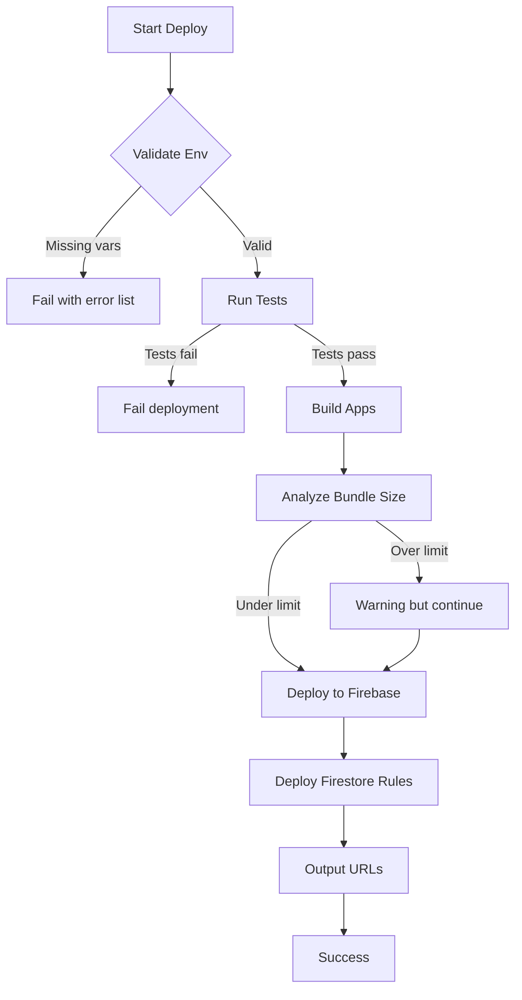

# Design Document: Phase 8 - Polish & Deploy

## Overview

Phase 8 hoàn thiện The Design Council LMS với focus vào:
1. **UI/UX Polish**: Loading states, empty states, toast notifications, form validation
2. **Performance**: Bundle optimization, caching, lazy loading
3. **Error Handling**: Error boundaries, network errors, validation errors
4. **Testing**: Unit tests, property tests, integration tests
5. **Deployment**: Automated deployment pipeline với validation
6. **Documentation**: README, help pages, code comments

## Architecture

```
┌─────────────────────────────────────────────────────────────────┐
│                     Production Architecture                      │
├─────────────────────────────────────────────────────────────────┤
│                                                                  │
│  ┌──────────────┐  ┌──────────────┐  ┌──────────────┐          │
│  │   Auth App   │  │  Admin App   │  │ Student App  │          │
│  │  (Next.js)   │  │  (Next.js)   │  │  (Next.js)   │          │
│  └──────┬───────┘  └──────┬───────┘  └──────┬───────┘          │
│         │                 │                 │                   │
│         └────────────┬────┴────────────────┘                   │
│                      │                                          │
│              ┌───────▼───────┐                                  │
│              │ Firebase SDK  │                                  │
│              │  (packages/   │                                  │
│              │   firebase)   │                                  │
│              └───────┬───────┘                                  │
│                      │                                          │
│  ┌───────────────────┼───────────────────┐                     │
│  │           Firebase Services           │                     │
│  │  ┌─────────┐ ┌─────────┐ ┌─────────┐ │                     │
│  │  │  Auth   │ │Firestore│ │ Storage │ │                     │
│  │  └─────────┘ └─────────┘ └─────────┘ │                     │
│  └───────────────────────────────────────┘                     │
│                                                                  │
│  ┌───────────────────────────────────────┐                     │
│  │         Firebase Hosting              │                     │
│  │  auth.tdc.vn | admin.tdc.vn | student │                     │
│  └───────────────────────────────────────┘                     │
│                                                                  │
└─────────────────────────────────────────────────────────────────┘
```

## Components and Interfaces

### 1. UI Components

#### Loading States
```typescript
// packages/ui/src/components/Skeleton/Skeleton.tsx
interface SkeletonProps {
  variant: 'text' | 'circular' | 'rectangular';
  width?: string | number;
  height?: string | number;
  className?: string;
}

// packages/ui/src/components/LoadingSpinner/LoadingSpinner.tsx
interface LoadingSpinnerProps {
  size?: 'sm' | 'md' | 'lg';
  className?: string;
}
```

#### Empty States
```typescript
// packages/ui/src/components/EmptyState/EmptyState.tsx
interface EmptyStateProps {
  icon?: React.ReactNode;
  title: string;
  description?: string;
  action?: {
    label: string;
    onClick: () => void;
  };
}
```

#### Toast Notifications
```typescript
// packages/ui/src/components/Toast/Toast.tsx
interface ToastProps {
  type: 'success' | 'error' | 'warning' | 'info';
  message: string;
  duration?: number;
  onClose?: () => void;
}

// packages/ui/src/hooks/useToast.ts
interface UseToastReturn {
  toast: (props: Omit<ToastProps, 'onClose'>) => void;
  success: (message: string) => void;
  error: (message: string) => void;
  warning: (message: string) => void;
  info: (message: string) => void;
}
```

### 2. Error Handling Components

#### Error Boundary
```typescript
// packages/ui/src/components/ErrorBoundary/ErrorBoundary.tsx
interface ErrorBoundaryProps {
  children: React.ReactNode;
  fallback?: React.ReactNode;
  onError?: (error: Error, errorInfo: React.ErrorInfo) => void;
}

interface ErrorBoundaryState {
  hasError: boolean;
  error: Error | null;
}
```

#### Error Page
```typescript
// packages/ui/src/components/ErrorPage/ErrorPage.tsx
interface ErrorPageProps {
  title?: string;
  message?: string;
  showRetry?: boolean;
  onRetry?: () => void;
  showHome?: boolean;
}
```

### 3. Performance Utilities

#### Query Configuration
```typescript
// packages/firebase/src/config/queryConfig.ts
export const defaultQueryConfig = {
  staleTime: 5 * 60 * 1000, // 5 minutes
  cacheTime: 30 * 60 * 1000, // 30 minutes
  retry: 3,
  retryDelay: (attemptIndex: number) => Math.min(1000 * 2 ** attemptIndex, 30000),
};

export const realtimeQueryConfig = {
  staleTime: 0,
  cacheTime: 5 * 60 * 1000,
  refetchOnWindowFocus: true,
};
```

### 4. Deployment Scripts

#### Enhanced Deploy Script
```bash
# scripts/deploy.sh
#!/bin/bash
set -e

# 1. Validate environment
node scripts/validate-env.js --strict

# 2. Run tests
pnpm test:run

# 3. Build all apps
pnpm build

# 4. Analyze bundle sizes
node scripts/build-analyze.js

# 5. Deploy to Firebase
firebase deploy --only hosting,firestore:rules

# 6. Output URLs
echo "Deployed URLs:"
echo "  Auth: https://auth.thedesigncouncil.vn"
echo "  Admin: https://admin.thedesigncouncil.vn"
echo "  Student: https://student.thedesigncouncil.vn"
```

## Data Models

### Error Types
```typescript
// packages/types/src/error.types.ts
export interface AppErrorDetails {
  code: string;
  message: string;
  field?: string;
  originalError?: unknown;
}

export interface ValidationError {
  field: string;
  message: string;
  code: string;
}

export interface NetworkError extends AppError {
  statusCode?: number;
  retryable: boolean;
}
```

### Toast State
```typescript
// packages/ui/src/components/Toast/toast.types.ts
export interface ToastState {
  id: string;
  type: 'success' | 'error' | 'warning' | 'info';
  message: string;
  duration: number;
  createdAt: number;
}
```

## Correctness Properties

*A property is a characteristic or behavior that should hold true across all valid executions of a system-essentially, a formal statement about what the system should do. Properties serve as the bridge between human-readable specifications and machine-verifiable correctness guarantees.*

### Property 1: UI State Rendering Consistency
*For any* component that displays data, when the loading state is true, the component SHALL render a skeleton/loading indicator, and when the data array is empty, the component SHALL render an empty state.
**Validates: Requirements 1.1, 1.2**

### Property 2: Form Validation Error Display
*For any* form input with validation rules, when invalid data is submitted, the form SHALL display inline error messages AND preserve the user's input values.
**Validates: Requirements 1.5, 3.3**

### Property 3: Error Boundary Recovery
*For any* component wrapped in an Error Boundary, when a runtime error occurs, the Error Boundary SHALL catch the error and render a fallback UI instead of crashing the entire application.
**Validates: Requirements 3.1**

### Property 4: Network Error Handling
*For any* network request that fails, the system SHALL display a user-friendly error message that includes the error type and provide a retry mechanism.
**Validates: Requirements 3.2**

### Property 5: Firestore Error Mapping
*For any* Firestore operation that fails, the error SHALL be mapped to a user-friendly AppError with appropriate error code and message.
**Validates: Requirements 3.5**

### Property 6: Environment Validation
*For any* deployment attempt, if required environment variables are missing, the deployment SHALL fail with a clear error message listing the missing variables.
**Validates: Requirements 5.1**

## Error Handling

### Error Hierarchy
```
AppError (base)
├── ValidationError
│   └── FormValidationError
├── NetworkError
│   ├── TimeoutError
│   └── ConnectionError
├── AuthError
│   ├── UnauthorizedError
│   └── SessionExpiredError
└── FirestoreError
    ├── NotFoundError
    ├── PermissionDeniedError
    └── QuotaExceededError
```

### Error Recovery Strategies
| Error Type | Recovery Strategy |
|------------|-------------------|
| Network timeout | Auto-retry with exponential backoff (max 3 attempts) |
| Auth expired | Redirect to login with return URL |
| Validation error | Display inline errors, preserve input |
| Firestore permission | Display error message, suggest contact admin |
| Unknown error | Display generic error page with retry option |

## Testing Strategy

### Dual Testing Approach

#### Unit Tests
- Test individual components in isolation
- Test utility functions with specific inputs
- Test hooks with mock data
- Focus on edge cases and error conditions

#### Property-Based Tests
- Use `fast-check` library for property-based testing
- Test UI state rendering with random loading/data states
- Test form validation with random invalid inputs
- Test error handling with random error types
- Configure minimum 100 iterations per property test

### Test File Structure
```
apps/admin/src/
├── components/
│   └── features/
│       └── student-management/
│           ├── StudentList.tsx
│           └── __tests__/
│               ├── StudentList.test.tsx      # Unit tests
│               └── StudentList.property.test.tsx  # Property tests
├── hooks/
│   └── __tests__/
│       ├── useStudents.test.ts
│       └── useStudents.property.test.ts
```

### Property Test Format
```typescript
// Example property test annotation
/**
 * **Feature: phase-8-polish-deploy, Property 1: UI State Rendering Consistency**
 * **Validates: Requirements 1.1, 1.2**
 */
describe('UI State Rendering', () => {
  it('should render loading state when isLoading is true', () => {
    fc.assert(
      fc.property(fc.boolean(), (isLoading) => {
        // Test implementation
      }),
      { numRuns: 100 }
    );
  });
});
```

### Coverage Requirements
- Overall coverage: ≥70%
- Critical paths (auth, CRUD operations): ≥80%
- UI components: ≥60%
- Utility functions: ≥90%

## Deployment Pipeline



### Deployment Targets
| Target | Command | Description |
|--------|---------|-------------|
| all | `pnpm deploy` | Deploy all apps + rules |
| auth | `pnpm deploy:auth` | Deploy Auth app only |
| admin | `pnpm deploy:admin` | Deploy Admin app only |
| student | `pnpm deploy:student` | Deploy Student app only |
| rules | `pnpm deploy:rules` | Deploy Firestore rules only |

### Environment Configuration
```env
# Production URLs
NEXT_PUBLIC_AUTH_URL=https://auth.thedesigncouncil.vn
NEXT_PUBLIC_ADMIN_URL=https://admin.thedesigncouncil.vn
NEXT_PUBLIC_STUDENT_URL=https://student.thedesigncouncil.vn

# Firebase Production
NEXT_PUBLIC_FIREBASE_API_KEY=xxx
NEXT_PUBLIC_FIREBASE_AUTH_DOMAIN=xxx
NEXT_PUBLIC_FIREBASE_PROJECT_ID=xxx
NEXT_PUBLIC_FIREBASE_STORAGE_BUCKET=xxx
NEXT_PUBLIC_FIREBASE_MESSAGING_SENDER_ID=xxx
NEXT_PUBLIC_FIREBASE_APP_ID=xxx
```
