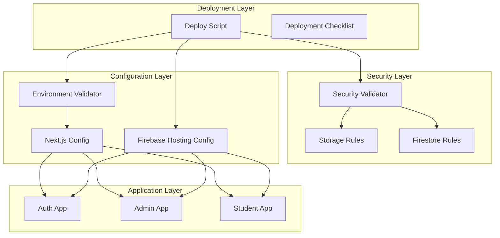

# Design Document: Production Readiness Fixes

## Overview

Tài liệu này mô tả thiết kế chi tiết để khắc phục các vấn đề được phát hiện trong quá trình đánh giá dự án The Design Council LMS trước khi deploy production. Các thay đổi bao gồm:

1. Khắc phục lỗ hổng bảo mật trong Firebase Storage rules
2. Cập nhật environment variable validation
3. Cấu hình Next.js cho static export
4. Giải quyết cross-domain authentication cho media upload
5. Cập nhật deployment scripts và documentation
6. Tạo security validation script

## Architecture



## Components and Interfaces

### 1. Firebase Storage Rules (firebase/storage.rules)

**Current Issue:**
```javascript
// TEMPORARY: Allow all writes for testing
allow write: if isValidSize();
```

**Fixed Design:**
```javascript
match /media/{allPaths=**} {
  // Anyone can read media files (for login backgrounds)
  allow read: if true;
  
  // Only authenticated users can upload media files
  // Admin check via custom claims for production security
  allow write: if isAuthenticated() && isValidSize();
}
```

**Interface:**
- `isAuthenticated()`: Returns true if request.auth != null
- `isAdmin()`: Returns true if user has admin role in custom claims
- `isValidSize()`: Returns true if file size < 10MB

### 2. Environment Variable Validator (scripts/validate-env.js)

**Current Issue:**
```javascript
validate: (value) => value && value.includes('.appspot.com'),
```

**Fixed Design:**
```javascript
validate: (value) => value && (
  value.includes('.appspot.com') || 
  value.includes('.firebasestorage.app')
),
```

**Interface:**
```typescript
interface EnvValidationResult {
  success: boolean;
  mode: 'development' | 'production';
  results: {
    required: ValidationGroup;
    production: ValidationGroup;
    urls: ValidationGroup;
  };
  errors: ValidationError[];
}

interface ValidationGroup {
  valid: EnvVar[];
  invalid: EnvVar[];
  missing: EnvVar[];
  defaults?: EnvVar[];
}
```

### 3. Next.js Static Export Configuration

**Files to modify:**
- `apps/auth/next.config.js`
- `apps/admin/next.config.js`
- `apps/student/next.config.js`

**Design:**
```javascript
/** @type {import('next').NextConfig} */
const nextConfig = {
  output: 'export',  // Enable static export
  trailingSlash: true,  // Required for Firebase Hosting
  // ... existing config
};
```

**Dynamic Routes Handling:**
For routes like `/courses/[id]`, add `generateStaticParams`:
```typescript
export async function generateStaticParams() {
  // Return empty array for client-side only rendering
  return [];
}
```

### 4. Security Validation Script (scripts/validate-security.js)

**New Component Design:**

```typescript
interface SecurityCheck {
  name: string;
  file: string;
  check: (content: string) => SecurityIssue[];
}

interface SecurityIssue {
  severity: 'error' | 'warning';
  file: string;
  line?: number;
  message: string;
  recommendation: string;
}

interface SecurityValidationResult {
  passed: boolean;
  issues: SecurityIssue[];
  summary: {
    errors: number;
    warnings: number;
  };
}
```

**Security Checks:**
1. Unauthenticated write detection in storage.rules
2. Overly permissive read rules in firestore.rules
3. TODO/TEMPORARY comment detection
4. Missing authentication checks

### 5. Deploy Script Updates (scripts/deploy.sh)

**Enhanced Flow:**
```
1. Validate environment (--strict for production)
2. Run security validation
3. Run tests
4. Build all apps
5. Validate build outputs
6. Deploy to Firebase
7. Output verification steps
```

## Data Models

### Security Issue Model
```typescript
interface SecurityIssue {
  id: string;
  severity: 'error' | 'warning' | 'info';
  category: 'storage' | 'firestore' | 'config';
  file: string;
  lineNumber?: number;
  code: string;
  message: string;
  recommendation: string;
  autoFixable: boolean;
}
```

### Validation Result Model
```typescript
interface ValidationResult {
  timestamp: Date;
  mode: 'development' | 'production';
  environment: {
    valid: boolean;
    errors: string[];
  };
  security: {
    valid: boolean;
    issues: SecurityIssue[];
  };
  build: {
    valid: boolean;
    apps: {
      auth: BuildResult;
      admin: BuildResult;
      student: BuildResult;
    };
  };
}

interface BuildResult {
  success: boolean;
  outputDir: string;
  hasStaticExport: boolean;
  bundleSize: number;
}
```

## Correctness Properties

*A property is a characteristic or behavior that should hold true across all valid executions of a system-essentially, a formal statement about what the system should do. Properties serve as the bridge between human-readable specifications and machine-verifiable correctness guarantees.*

### Property 1: Storage bucket validation accepts both formats
*For any* storage bucket value, if it ends with `.appspot.com` OR `.firebasestorage.app`, then the validation function should return true
**Validates: Requirements 2.1, 2.2**

### Property 2: Environment validation consistency
*For any* set of valid environment variables, running validation should always produce the same result (deterministic)
**Validates: Requirements 2.4**

### Property 3: Invalid environment produces error with format hint
*For any* invalid environment variable value, the error message should contain the expected format pattern
**Validates: Requirements 2.5**

### Property 4: Security rules contain no unauthenticated writes
*For any* storage rules file, parsing and checking should detect any `allow write` rule that doesn't require `isAuthenticated()`
**Validates: Requirements 1.4, 1.5, 6.1**

### Property 5: TODO/TEMPORARY detection in rules
*For any* rules file containing TODO or TEMPORARY comments, the security validator should flag them as warnings
**Validates: Requirements 6.5**

### Property 6: Security issue reporting completeness
*For any* detected security issue, the report should include file path, line number (if applicable), and recommendation
**Validates: Requirements 6.3**

### Property 7: Firebase config and Next.js config alignment
*For any* app where firebase.json references `out` directory, the corresponding next.config.js must have `output: 'export'`
**Validates: Requirements 3.5**

### Property 8: File size validation boundary
*For any* file upload attempt, files larger than 10MB should be rejected regardless of authentication status
**Validates: Requirements 1.3**

## Error Handling

### Storage Upload Errors
```typescript
enum StorageUploadError {
  UNAUTHENTICATED = 'storage/unauthenticated',
  FILE_TOO_LARGE = 'storage/file-too-large',
  INVALID_TYPE = 'storage/invalid-type',
  PERMISSION_DENIED = 'storage/permission-denied',
  NETWORK_ERROR = 'storage/network-error',
}

function handleStorageError(error: StorageUploadError): UserMessage {
  switch (error) {
    case StorageUploadError.UNAUTHENTICATED:
      return {
        message: 'Vui lòng đăng nhập để upload file',
        action: 'Đăng nhập lại',
        retryable: true,
      };
    case StorageUploadError.FILE_TOO_LARGE:
      return {
        message: 'File quá lớn. Giới hạn tối đa 10MB',
        action: 'Chọn file nhỏ hơn',
        retryable: false,
      };
    // ... other cases
  }
}
```

### Validation Errors
```typescript
interface ValidationError {
  type: 'MISSING_REQUIRED' | 'INVALID_FORMAT' | 'SECURITY_ISSUE';
  message: string;
  variables?: string[];
  fix?: string;
}
```

## Testing Strategy

### Dual Testing Approach

This feature requires both unit tests and property-based tests:

**Unit Tests:**
- Test specific validation scenarios
- Test error message formatting
- Test script exit codes

**Property-Based Tests:**
- Test validation logic across many input variations
- Test security detection patterns
- Test configuration consistency

### Property-Based Testing Library
We will use **fast-check** (already installed in the project) for property-based testing.

### Test Configuration
Each property-based test should run a minimum of 100 iterations.

### Test Annotations
Each property-based test must be tagged with:
```typescript
// **Feature: production-readiness-fixes, Property {number}: {property_text}**
```

### Test Files Structure
```
scripts/__tests__/
├── validate-env.property.test.ts      # Existing, extend
├── validate-security.property.test.ts # New
└── validate-security.test.ts          # New unit tests

firebase/__tests__/
└── storage-rules.test.ts              # New - rules validation
```

### Key Test Scenarios

1. **Environment Validation Tests:**
   - Valid `.appspot.com` bucket
   - Valid `.firebasestorage.app` bucket
   - Invalid bucket formats
   - Missing required variables
   - Strict mode with localhost URLs

2. **Security Validation Tests:**
   - Detect unauthenticated write rules
   - Detect TODO/TEMPORARY comments
   - Pass clean rules files
   - Report correct line numbers

3. **Build Configuration Tests:**
   - Verify `output: 'export'` presence
   - Verify `out` directory creation
   - Verify firebase.json alignment

